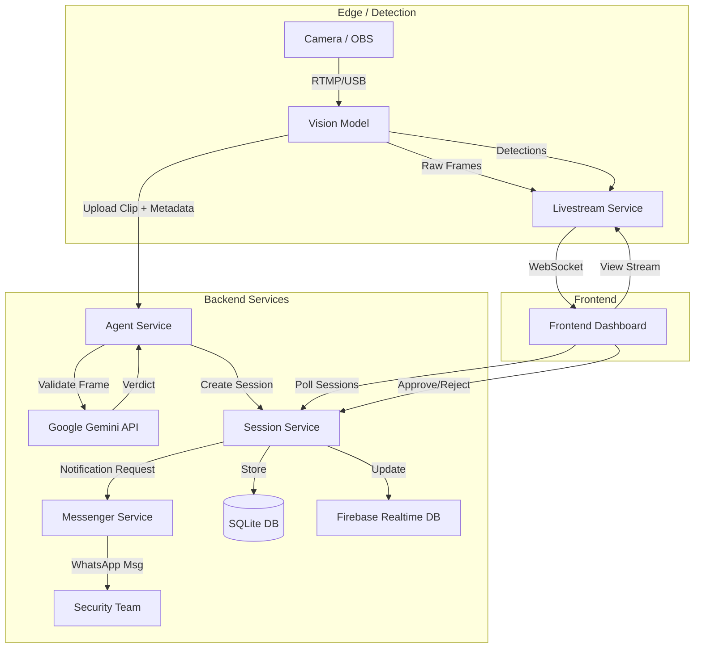

# CrowdShield Technical Architecture

CrowdShield is a real-time safety monitoring system utilizing AI to detect incidents (Fire, Violence, Stampede) from camera feeds. It employs a microservices architecture to handle detection, verification, storage, and user alerts across a distributed system.

## System Overview

The system consists of five main components:
1.  **Vision Model**: Edge detection using YOLOv8.
2.  **Agent Service**: AI Verification using Google Gemini.
3.  **Session Service**: Backend API for state management and storage.
4.  **Livestream Service**: Low-latency video streaming.
5.  **Messenger Service**: WhatsApp notification automation.
6.  **Frontend**: Next.js Dashboard for monitoring and control.

### Architecture Diagram

## Component Details

### 1. Vision Model (`model/vision-model`)
*   **Role**: Real-time video processing and event detection.
*   **Technology**: Python, OpenCV, YOLOv8.
*   **Key Functions**:
    *   Captures video from the camera (Default: Index 1 for OBS, fallback to 0).
    *   Runs concurrent detection for **Fire**, **Violence** (Fights), and **Stampede** (Crowd Density).
    *   Streams annotated frames and metadata to the **Livestream Service** via WebSocket.
    *   On detecting an incident, records a 10-second video clip and uploads it to the **Agent**.

### 2. Agent Service (`model/agent`)
*   **Port**: `8001`
*   **Role**: Intelligent verification layer to reduce false positives.
*   **Technology**: FastAPI, Google Gemini 2.5 Flash.
*   **Workflow**:
    *   Receives video clips from the Vision Model.
    *   Extracts a representative frame (middle of the clip).
    *   Queries **Google Gemini** to classify the scene (Fire, Violence, Safe, Stampede) and assess severity/confidence.
    *   If the incident is verified (not "Normal"), it posts the session data to the **Session Service**.

### 3. Session Service (`backend/session`)
*   **Port**: `8002`
*   **Role**: Central backend for session management and persistence.
*   **Technology**: FastAPI, SQLite (`crowd_shield.db`).
*   **Key Endpoints**:
    *   `POST /upload`: Creates a new session (pending approval).
    *   `GET /sessions`: Lists all active and past sessions.
    *   `POST /session/{id}/approve`: Marks session as approved and triggers notifications.
    *   `POST /session/{id}/reject`: Marks session as rejected.

### 4. Livestream Service (`backend/livestream`)
*   **Port**: `8000`
*   **Role**: WebSocket relay for low-latency video streaming to the frontend.
*   **Methods**:
    *   `WebSocket /ws/push/{camera_id}`: Receives frames from Vision Model.
    *   `GET /video_feed/{camera_id}`: Streams MJPEG to the browser.

### 5. Messenger Service (`backend/messenger`)
*   **Port**: `8003`
*   **Role**: Automates WhatsApp Web to send notifications.
*   **Technology**: Playwright, FastAPI.
*   **Function**:
    *   Maintains a persistent browser session for WhatsApp Web.
    *   `POST /send-message`: Sends text messages to specified phone numbers.

### 6. Frontend (`frontend`)
*   **Port**: `3000`
*   **Role**: User Interface for security personnel.
*   **Technology**: Next.js, TailwindCSS.
*   **Features**:
    *   Displays the live video feed.
    *   Shows a list of pending incidents with recorded clips.
    *   Allows Admins to **Approve** (dispatch help) or **Reject** (false alarm) incidents.

## End-to-End Workflow

1.  **Detection**: The **Vision Model** detects "Fire" with high confidence. It starts recording and sends visual alerts to the Live Feed.
2.  **Verification**: The recorded clip is sent to the **Agent**. The Agent asks Gemini, "Is there a fire?". Gemini confirms "Yes, Severity: Critical".
3.  **Session Creation**: The Agent sends the verified incident to the **Session Service**, creating a "Pending" session in the database.
4.  **Monitoring**: The **Frontend** polls the Session Service and displays a red alert banner with the "Fire" label and the recorded clip.
5.  **Action**: A security officer reviews the clip on the dashboard and clicks **"Approve"**.
6.  **Response**:
    *   The Session Service updates the status to "Approved".
    *   It calls the **Messenger Service** to send a WhatsApp alert: *"✅ INCIDENT APPROVED: Fire detected! [Link]"*.
    *   It updates **Firebase** to trigger physical alarms (e.g., LED strips).

## Deployment & Startup

The system is designed to run locally or on a server.
*   **Start Backend**: `backend/session/main.py`
*   **Start Agent**: `model/agent/main.py`
*   **Start Vision**: `model/vision-model/main.py`
*   **Start Messenger**: `backend/messenger/main.py`
*   **Start Livestream**: `backend/livestream/main.py`
*   **Start Frontend**: `npm run dev` in `frontend/`

Use `start_missing_services.ps1` to help bootstrap the session service on Windows.
